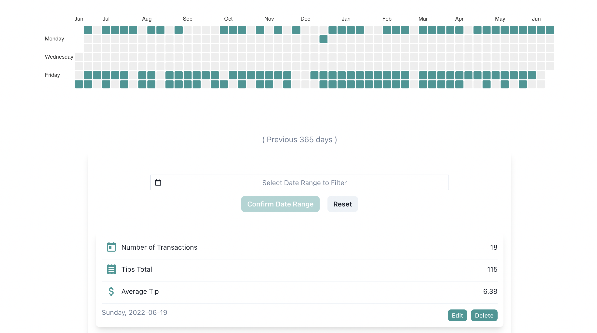
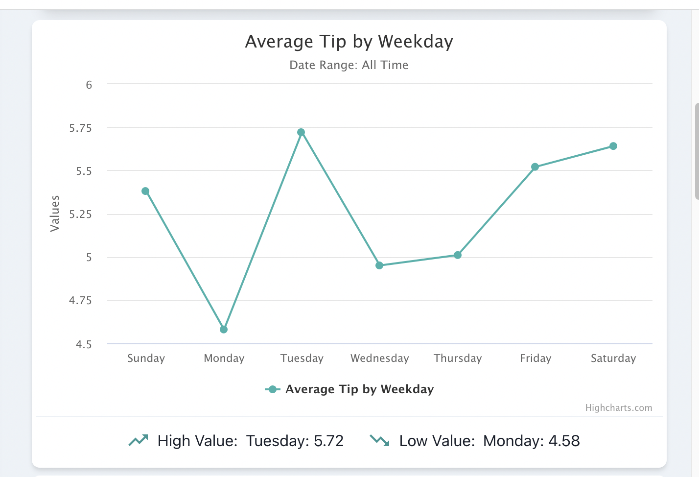
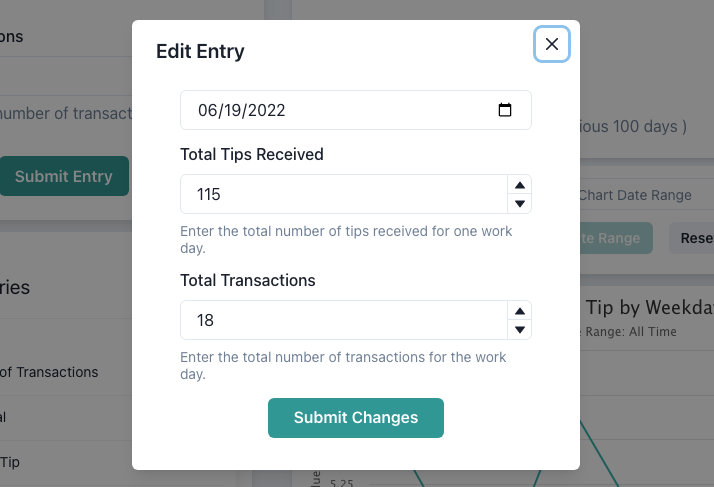

## Tip Tracker 

A full stack web application which allows service industry workers and employees to track and analyze tips received over time. Built with the MERN stack which includes React on the frontend along with ChakraUI for styling. The backend is comprised of Node, Express, and MongoDB. 

## Demo

In order to demo the application without requiring signup, enter "demo@demo.com" as the email address and "demo1234" at the live application located:

`https://tip-tracker-mern.herokuapp.com/`  

## Features
- Ability to add, delete, and edit entries into a log/history which keeps a record of the total number of transactions, the total number of tips received, and then calculates the average tip for that working period.
- Several graphical representations of the data entered which includes data shown in several metrics, including average tip, number of transactions, total tips received, and more for several time periods including day, month, week, year. 
- Graphical representations of data can be filtered to only include entries in between dates of the users choosing. 
- A heatmap of a variable amount of time representing dates worked and the entry data for that date at a glance. 
- JSON web tokens to enable user authorization and authentication. 

## Project Screen Shot(s)

#### Home Page:   

#### Interactive Heatmap:  

#### Charts & Insights:  

#### All Standard CRUD Operations Supported:  

## Installation and Setup Instructions 

To clone this repository, you will need `node` and `npm` installed globally on your machine.  

#### Installation will require running

`npm install`  

both in the client and server folders in order to install dependencies for both.

#### To Start Server:

`npm run server`

will initiate a script which runs 

`nodemon server.js`

#### To Start Client and Server Concurrently:

`npm run dev`

#### To visit app demo live:

`https://tip-tracker-mern.herokuapp.com/`  

Note: Please allow 5 - 10 seconds for server to awake.
